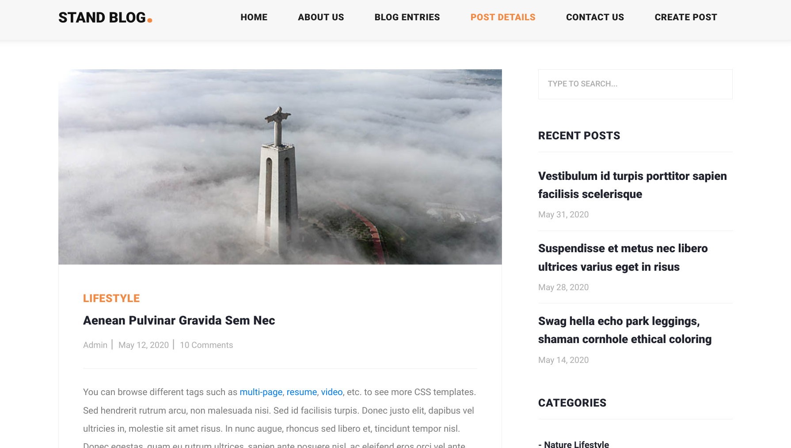
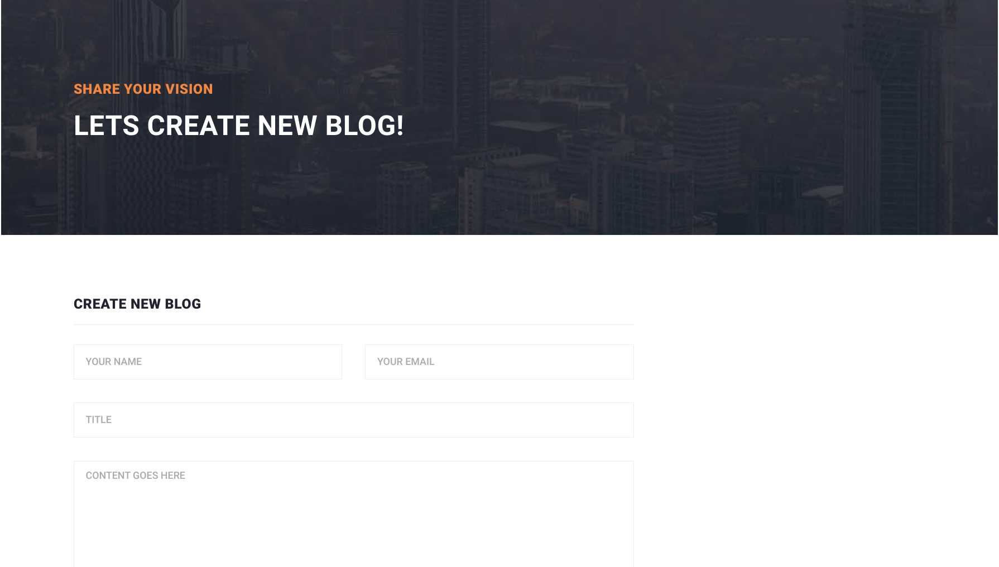
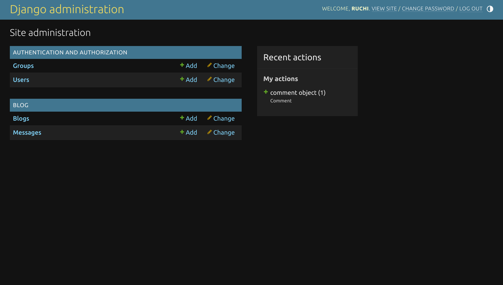

## Standblog - A blogging Website
This project is a mini version of a working blogging website. This project uses only HTML, CSS, and JS for frontend and django for backend.

## 💻 Technologies Used ( Frontend )
<p align="center">
  <a href="https://skillicons.dev">
    
  </a>
</p>

## 💻 Technologies Used ( Backend & Docker Functionality )

- 🛠️ **Django** for the backend
- 🛢️ **sqlite** for database storage
- 🐳 **Docker** for containerization


## Installation 📦
-  **Update the package list :** sudo apt update
- **Install Python 3:** sudo apt install python3
- **Install pip:** sudo apt install python3-pip
- **Install Django:** sudo pip3 install django
- **Verify Django installation:** django-admin --version

#### Clone

- Clone this repo to your local machine.

#### Run server locally
```shell
$ pip install requirements.txt
```

```shell
$ python manage.py runserver
```
> Go to localhost:8000

----


 **Screenshots**: 

<h3 align="center"> Home Page</h3>

<h3 align="center"> Post View</h3>

<h3 align="center"> Post Create</h3>

<h3 align="center"> Admin Dashboard </h3>



<h3  align="center" > Don't forget to hit the :star: if you like this repo. </h3>
<h1 align="center"> Made with ❤️ by <a href="https://github.com/RuchiLamichhane">Ruchi</a> </h1>
